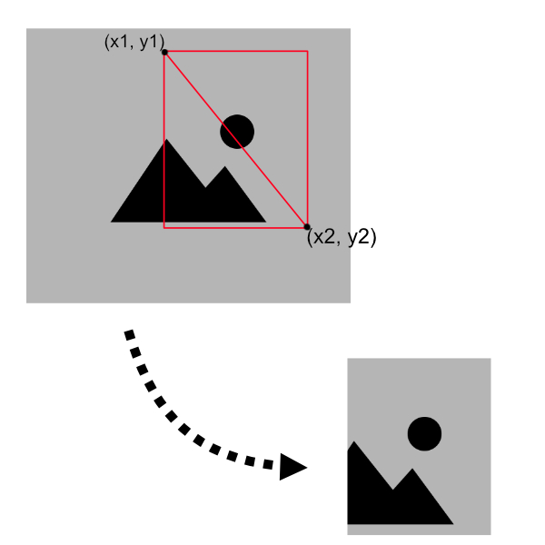

# pillow usage

### Crop an image using python with pillow library
The zero is in the upper left corner of the picture. x1 y1 x2 y2 are all positive values.

```python
from PIL import Image

x1 = 0
x2 = 0
y1 = 0
y2 = 0
coordinate = (x1, y1, x2, y2)

img = Image.open('path/to/image.jpg')
img = img.crop(coordinate)
img.save('path/to/image_des.jpg')
```

### Reduce the image resolution
If you want to convert your 900 x 1200 size image to 300 x 400 size.
```python
from PIL import Image
img = Image.open('path/to/image.jpg')
img.thumbnail((300, 400))
``` 

## Snippets

### crop and resize the image in center
```python
from PIL import Image as PilImage

image_path = 'path/to/image.jpg'
img = PilImage.open(image_path)
if not img.width == img.height:
    is_w_gt_y = img.width > img.height
    b = img.height if is_w_gt_y else img.width
    a = img.width if is_w_gt_y else img.height
    coordinate = ((a - b) / 2, 0, (a + b) / 2, b) if is_w_gt_y else (0, (a - b) / 2, b, (a + b) / 2)
    img = img.crop(coordinate)
if img.height > 500 or img.width > 500:
    img.thumbnail((500, 500))

img.save(image_path)
```